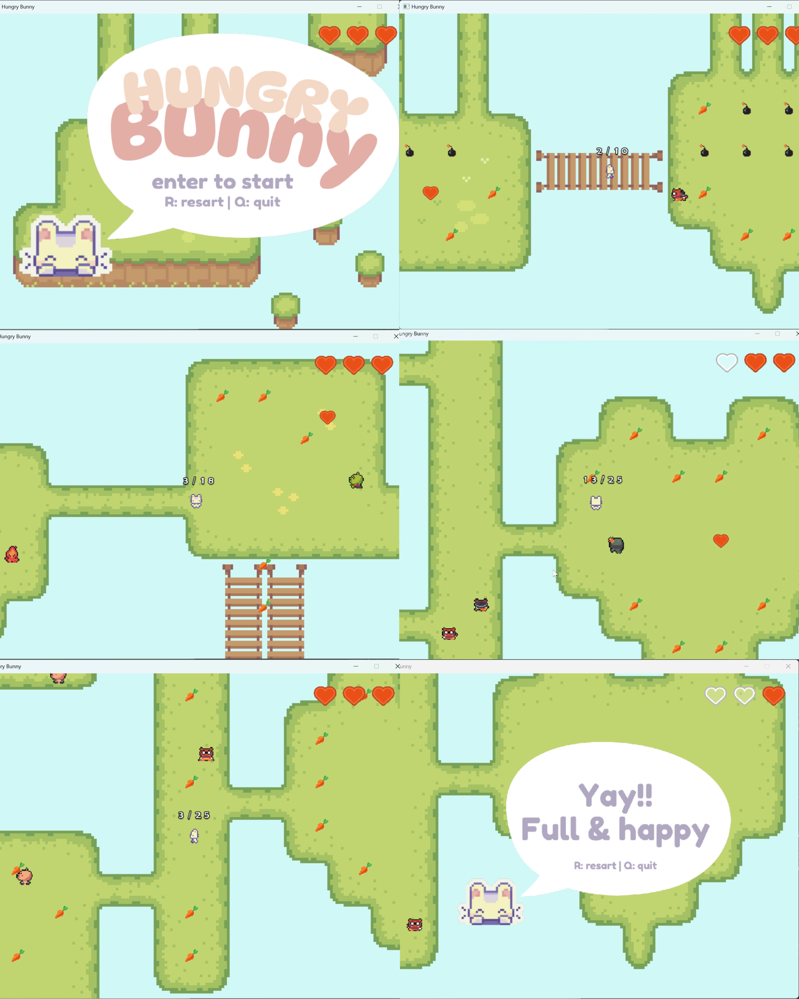

# Hungry Bunny 🐰🥕

A simple top-down 2D game created using SDL2 and C++, where you play as a hungry bunny collecting carrots across multiple levels while avoiding enemies and obstacles.

  

---

## 🎮 Gameplay

- Control the bunny using **arrow keys**
- **Collect all the carrots** in each level to advance
- **Avoid enemies and obstacles** — getting hit reduces your lives
- Pick up **hearts** to restore lost lives
- Press **R** anytime to return to the **main menu**
- Win the game by completing all levels with at least one life left

---

## 🧠 Features

- 3 distinct levels with increasing difficulty
- Multiple enemy types:
  - `OBSTACLE`: Static hazards
  - `WALKER`: Moves in a straight line
  - `GUARD`: Follows the player when nearby
  - `BOUNCER`: Reflects off walls like a pool ball
- Collectible items:
  - `CARROT`: Required to complete level
  - `HEART`: Restores 1 life
- Player feedback:
  - Dynamic lives display
  - Bunny "dialogue" for win/loss
  - Simple screen shake, sound effects, and animations

---

## 🛠️ Built With

- **C++**  
- **SDL2** (Rendering, Input, Audio)  
- **GLM** (Matrix math)  

---
